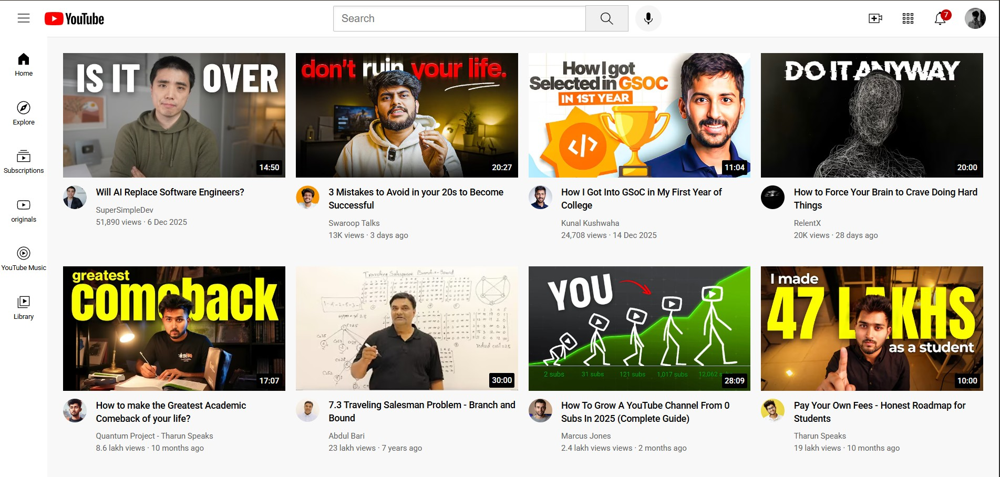
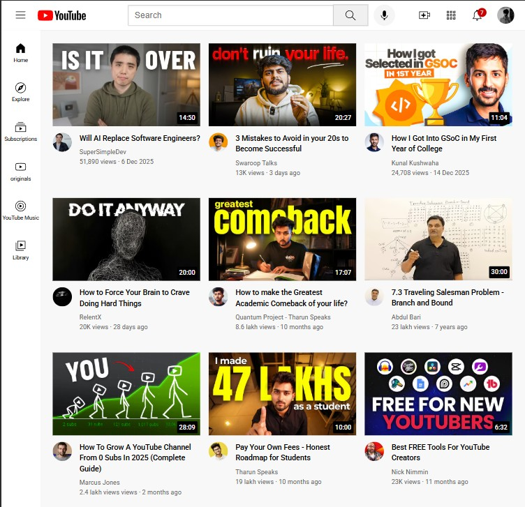

# YouTube Clone 🎬

A responsive **YouTube homepage UI clone** built using **HTML and CSS**.  
This project focuses on mastering real-world layout techniques used in modern web applications.

---

## 🚀 Project Overview

This project replicates the **core UI structure of YouTube**, including:
- Fixed header with search bar and action icons
- Sidebar navigation
- Responsive video grid layout
- Video cards with thumbnails, duration badges, and channel information

The goal of this project was **not to copy functionality**, but to deeply understand **layout design, responsiveness, and CSS positioning**.

---

## 🛠️ Technologies Used

- **HTML5**
- **CSS3**
  - Flexbox
  - CSS Grid
  - Media Queries
  - Positioning (relative, absolute, fixed)
  - Z-index
- Google Fonts (Roboto)

---

## 📐 Key Features

- 📱 **Responsive layout**
  - 2-column, 3-column, and 4-column video grid based on screen width
- 📌 **Fixed header and sidebar**
- 🧭 **Sidebar navigation with hover effects**
- ⏱️ **Video duration overlay on thumbnails**
- 💬 **Tooltips on header icons**
- 🖼️ **Reusable video card components**

---

## 📚 What I Learned (Important)

Through this project, I learned:

- How to structure a **real-world HTML layout** using semantic sections
- How to combine **Flexbox and CSS Grid** effectively
- How **fixed positioning** affects layout and spacing
- How to handle **overlapping elements** using `z-index`
- How to create **responsive designs** using media queries
- How to design **reusable UI components**
- How professional UIs manage spacing, alignment, and consistency
- How to organize assets (icons, images) properly in a project
- How to push a complete frontend project (including assets) to **GitHub**

---

## Project Structure

- youtube.html – Main HTML file  
- youtubestyle.css – Styling for the UI  
- icons/ – SVG icons  
- thumbnails/ – Video thumbnails  
- profile-pics/ – Channel profile images  

---

## ⚠️ Limitations

- This project is **UI-only**
- No JavaScript functionality yet
- Search, sidebar toggle, and interactivity are not implemented

---

## 🔮 Next Steps

- Add **JavaScript** for interactivity
  - Sidebar toggle
  - Search input handling
  - Dynamic tooltips
- Improve accessibility
- Add dark mode

---

## 📸 Screenshots

### 🖥️ Desktop View

  

### 📱 Responsive View

  

